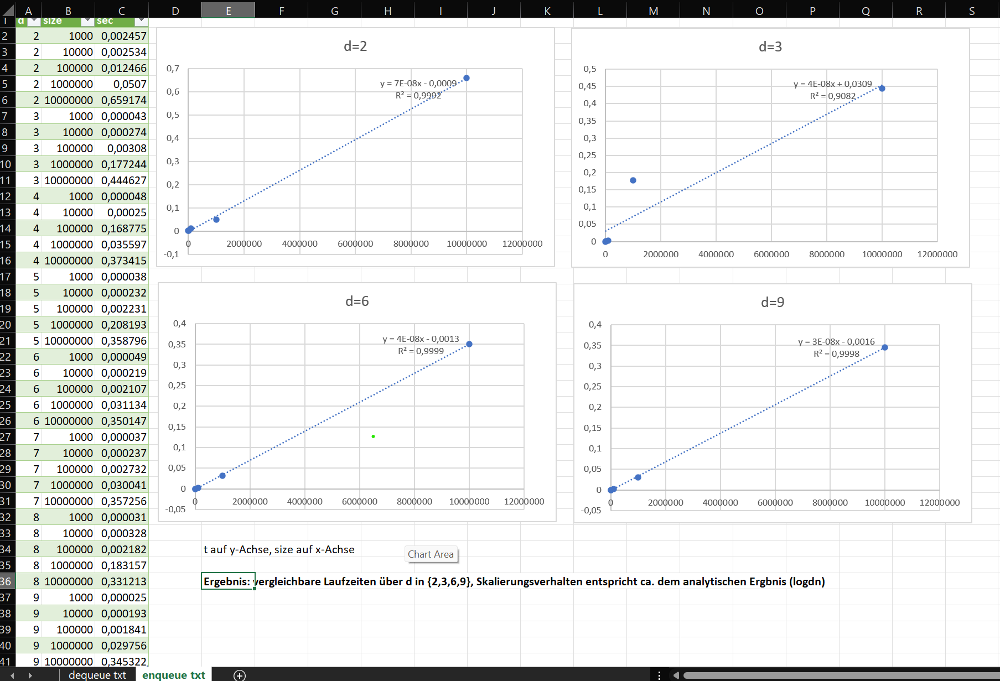
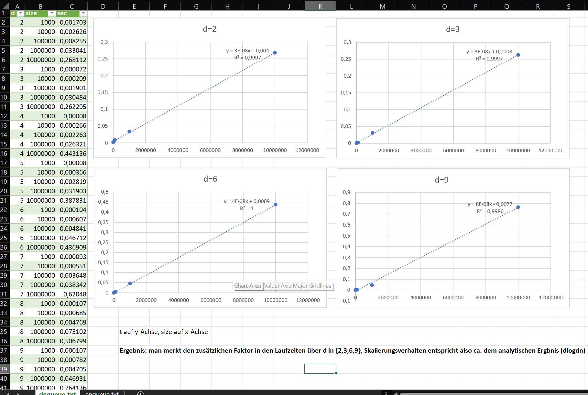

= SWE4.3: Ue03_Heseltine_Jack
Jack Heseltine <s2110307016@fh-hagenberg.at>
v1.0, 09.04.2023
:toc-title: Inhalt
:srcdir: ./src
:testdir: ./test
:icons: font
:toc: auto
:source-highlighter: rouge
:rouge-style: github

[float]
== Erfüllungsgrad

[cols=">,^,^,^,^,^,>"]
|====
| Nr | L   | I   | T   | Summe | Multiplikator  | Punkte
| 1a | 2/2 | 3/3 | 5/5 | 10    | 4              | 40
| 1b | 3/3 | 4/4 | 3/3 | 10    | 4              | 40
| 1c | 2/2 | 2/2 | 6/6 | 10    | 2              | 20
6+| Summe Erfüllungsgrad                        | 100
|====

==== Lösungsidee

===== a)

Heap aus der UE implementiert bereits das gegebene Interface PQueue, was nun formal auch dazugegeben wird.

Die Hauptarbeit in a) ist also das Testframework aufzusetzen erstmal, und dann Tests auf Heap abzustimmen. Ein paar Ideen im vorhinein dazu:

* Testung mit setUp und tearDown, immer eine neue Heap für die Test Cases, bzw bei tearDown Freigabe mit Nullsetzung
* Randomisiertes anlegen von Integern zum Testen im Falle von Integer-Templates
* weil es ja um ein Template geht, greiffe ich als zweiten Datentyp zum Testen Strings heraus und mache damit ähnliche Tests wie mit Integern
* Testung der vier gegebenen Methoden des Interfaces (nicht mehr, nicht weniger). Trotzdem brauche ich (im Vergleich zur UE) eine Hilfsmethode getSize() um enqueue/dequeue Operationen besser testen zu können.

===== b)

Bekanntlich sagt ein Bild mehr als d Worte, daher könnte ein d-ärer Heap wie folgt aussehen.

[source,c]
----
3-ary max heap:

        100
    /    |   \
  70     90   80
/  | \    \
40 60 50  70
----

d wird als einstellbare Größe gesehen, meine Recherche (Quelle: https://www.geeksforgeeks.org/k-ary-heap/) ergibt die Baumhöhe von \[ log_d n \]
Doch interessanter ist natürlich die Implementierung. Die wesentlichen Operationen folgen der binären Version (d war 2).

* Datenstruktur im Hintegrund: Feld, iniziert mit 0
* Eltern-Element? Beispiel: (s. Bild) 70 an Index 1 -> 0, 70 an Index 7 -> 2.
\[
\ i_p = \frac{i - 1}{d}
\]
* Kind-Elemente in umgekehrter Rechnung, mal d:
\[
\ i_{children} = \{ di_p + 1, di_p + 2, ... di_p + d \}
\]
* Demensprechend gibt es kein "left" und "right" Kind, sondern Kinder mit den Indizes 0 bis d - 1 (bei vollem Node).
* peek() und isEmpty() können von Heap übernommen werden.
* enqueue() ist ein Anfügen an das Hintergrund-Array mit einer upheap()-Methode, die die Heap-Eigenschaft herstellt.
* dequeue() funktioniert anders herrum mit downheap().

Dabei wird das Max-Element returned, das letzte Element aus dem Hintergrund-Feld an die Wurzel gegeben und der Baum berichtigt.

==== Implementierung

===== a) Heap (Ausarbeitung aus der UE als Grundlage)

[source,c]
----
include::{srcdir}/at/fhooe/swe4/queues/Heap.java[]
----

===== a) Interface (am HUE-Blatt gegeben)

[source,c]
----
include::{srcdir}/at/fhooe/swe4/queues/PQueue.java[]
----

===== b)

[source,c]
----
include::{srcdir}/at/fhooe/swe4/queues/DHeapQueue.java[]
----

==== Laufzeit (c)

Es folgt eine Gegenüberstellung von enqueue() und dequeue(), analytisch (erster Punkt) in Abhängigkeit von d und size, und als zweiter Punkt empirisch.

* Analytisch: *enqueue()* verwendet eine upheap() Operation, die im schlimmsten Fall die Höhe des Baums abarbeitet (Heap wiederherstellung.) Es folgt eine Laufzeitkomplexität von
\[
\ O(log_d n)
\]

Siehe Formel zur Höhe, n ist hierbei  size.

* Analytisch: *Dequeue()* erfodert nach einsetzen an der Stelle 0 des Feldes vom letzten Wert eine äußere while-Schleife, nämlich Höhe des Baums oft aufgerufen, und zusätzlich eine d-malige innere for-loop, also:
\[
\ O(dlog_d n)
\]

* Empirisch: Im main() von DHeapQueueTest.java (s. letzter Programausschnitt) wird nanoTime() und Randomisierung von enqueue()/dequeue()-Operationen über verschieden große Heaps verwendet (s. Hinweis der Angabe).

Auch als Excel auf Basis der Terminal-Exporte anbei, hier als Screenshots:

* enqueue()-n-d-Verhalten:

* dequeue()-n-d-Verhalten:

Man sieht, dequeue() skaliert schlechter mit size, aber v.a. auch, dass dequeue() mit steigendem d schlechter fährt.

Dafür skaliert enqueue() mit steigendem d relativ konstant.

==== Testung

===== a) HeapTest

[source,c]
----
include::{testdir}/at/fhooe/swe4/queues/HeapTest.java[]
----

===== b) DHeapQueueTest

[source,c]
----
include::{testdir}/at/fhooe/swe4/queues/DHeapQueueTest.java[]
----